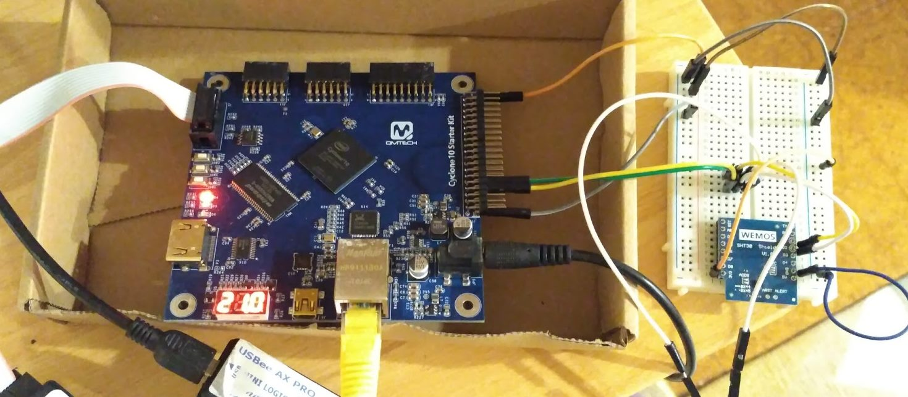
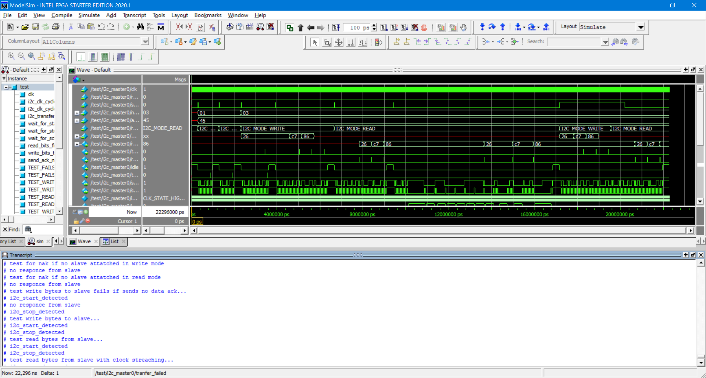

# I2C master device for FPGA

This is an I2C master device module written in SystemVerilog for FPGA. I have only tested it on Altera/Intel cyclone 10 LP 10CL016YU484C8G.

I started with code from https://github.com/mcgodfrey/i2c-eeprom , wrote a test bench to qualify the module and fixed it up to meet the requirements. I then connected it to an SHT30 temperature humidity I2C module. Finally I added some code to read from the temperature humidity sensor and output that value to the three segment LED display in centigrade. I have tested it up to the 1 megahertz rate that the SHT30 specifies and it works.

### Directory structure

[lib](lib) contains the driver modules needed for the I2C master device and the example project.

[lib/i2c](lib/i2c) is the folder that contains the I2C master device and is probably the one you will be interested in if you're reading this page.

[testbench](testbench) contains a test bench for qualifying the I2C device and instructions on how to use it with modelsim.

[example](example) contains a Quartus II project for the hardware that I used as well as some information about the setup.

Jonti 
2021

