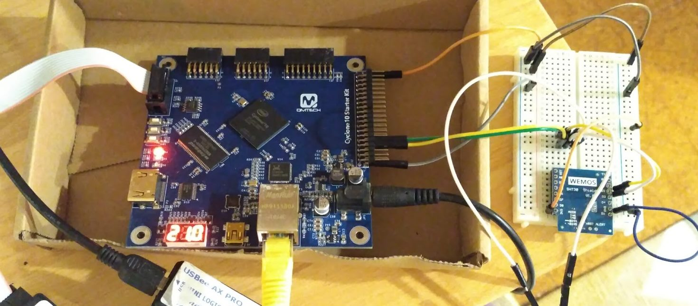

# Example for the SHT30 temperature humidity I2C module with a Cyclone 10 LP 10CL016YU484C8G Device

It shows the temperature in Celsius on the three segment LED display.

This folder contains a Quartus II project for the hardware in the following figure



### Hardware

QMTECH Cyclone 10 starter kit

WEMOS SHT30 shield V1.00


### Temperature humidity sensor module data sheet

https://www.mouser.com/datasheet/2/682/Sensirion_Humidity_Sensors_SHT3x_Datasheet_digital-971521.pdf

### Cyclone 10 Board pin out

```
#-------------pin locations assignments

set_location_assignment PIN_G1 -to clk_50M

set_location_assignment PIN_W17 -to led

set_location_assignment PIN_R18  -to segSelect[0]
set_location_assignment PIN_U19  -to segSelect[1]
set_location_assignment PIN_AB18 -to segSelect[2]
set_location_assignment PIN_AA19 -to segData[0]
set_location_assignment PIN_R19  -to segData[1]
set_location_assignment PIN_U20  -to segData[2]
set_location_assignment PIN_AB19 -to segData[3]
set_location_assignment PIN_AA18 -to segData[4]
set_location_assignment PIN_W20  -to segData[5]
set_location_assignment PIN_R20  -to segData[6]
set_location_assignment PIN_W19  -to segData[7]

set_location_assignment PIN_B19 -to i2c_scl_w
set_location_assignment PIN_B20 -to i2c_sda_w

#-------------pin assignments options

set_instance_assignment -name IO_STANDARD "3.3-V LVTTL" -to led

set_instance_assignment -name IO_STANDARD "3.3-V LVTTL" -to segData[7]
set_instance_assignment -name IO_STANDARD "3.3-V LVTTL" -to segData[6]
set_instance_assignment -name IO_STANDARD "3.3-V LVTTL" -to segData[5]
set_instance_assignment -name IO_STANDARD "3.3-V LVTTL" -to segData[4]
set_instance_assignment -name IO_STANDARD "3.3-V LVTTL" -to segData[3]
set_instance_assignment -name IO_STANDARD "3.3-V LVTTL" -to segData[2]
set_instance_assignment -name IO_STANDARD "3.3-V LVTTL" -to segData[1]
set_instance_assignment -name IO_STANDARD "3.3-V LVTTL" -to segData[0]
set_instance_assignment -name IO_STANDARD "3.3-V LVTTL" -to segSelect[2]
set_instance_assignment -name IO_STANDARD "3.3-V LVTTL" -to segSelect[1]
set_instance_assignment -name IO_STANDARD "3.3-V LVTTL" -to segSelect[0]

set_instance_assignment -name IO_STANDARD "3.3-V LVTTL" -to i2c_scl_w
set_instance_assignment -name IO_STANDARD "3.3-V LVTTL" -to i2c_sda_w
```